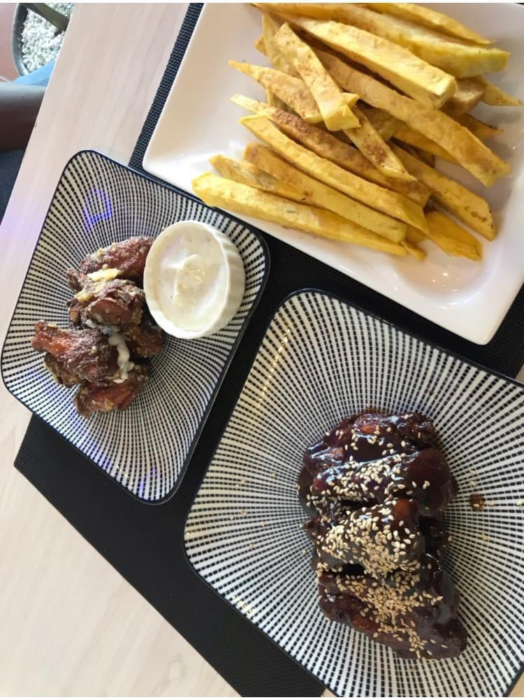
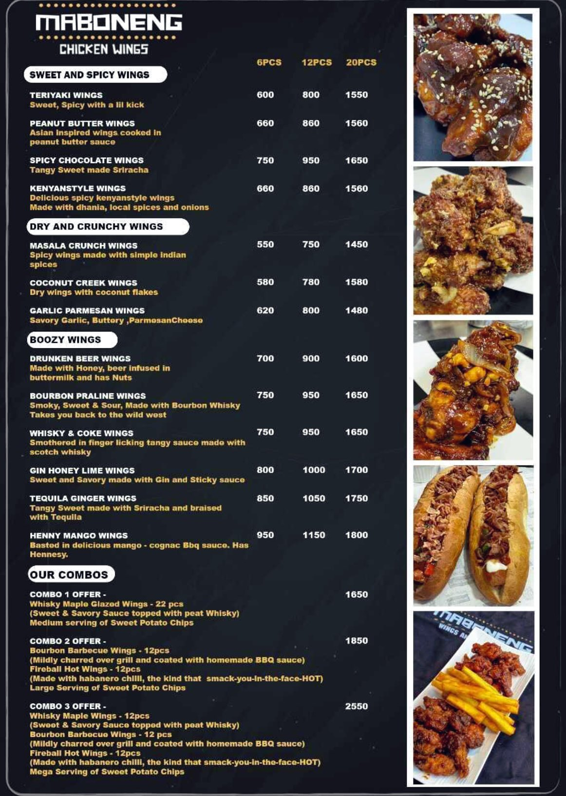
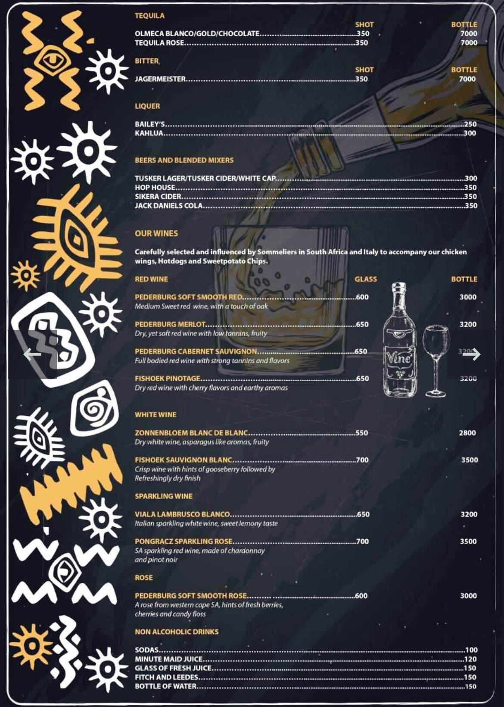

+++
title = 'Maboneng - Kilimani'
featured_image = "Maboneng.jpeg"
maps_query = "maboneng+kilimani+nairobi+kenya"
date = 2023-11-23T13:13:29+03:00
draft = false
+++

Maboneng Wings and Whisky is located at Ntashart Plaza, Kilimani which also has a Sno Cream parlour for those of you who are lucky enough to not be lactose intolerant & can handle their yummy ice-cream.

Maboneng Wings have a nice long selection of wings. I wanted to try a bit of everything but there’s only so many wings you can have in one sitting so it’ll force me to go back to try more. I had the sweet & spicy teriyaki wings and the garlic Parmesan wings. Both were super flavourful, I loved the garlic Parmesan the most out of the two. I also had some sweet potato fries on the side, they only do variations of sweet potato fries, they don’t make regular fries.

Wings were KSH650 for 6pcs, you can also get portions of 8pcs or 12. Fries were KSH250. I had their pineapple mint juice that I actually didn’t like… it’s quite hard to mess up pineapple mint so not sure why theirs was a miss like that.

All in all I liked the place, music being played was on point for us amapiano lovers. I enjoyed the food and will hopefully go back one day to try more of their wings selection.

### Ratings

Food:⭐️⭐️⭐️ 
Service:⭐️⭐️⭐️⭐️ 
Ambience: ⭐️⭐️⭐️ 

